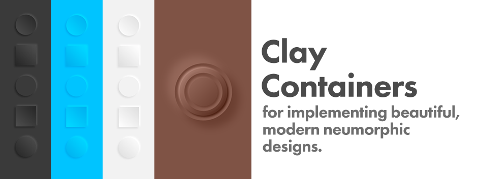
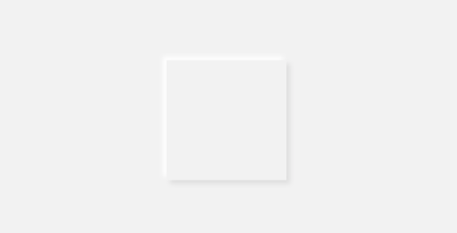
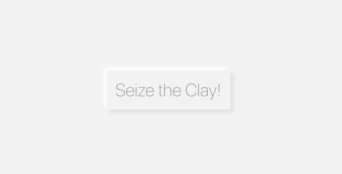
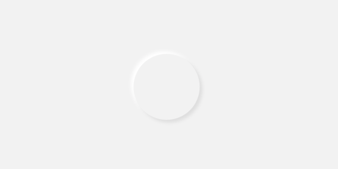
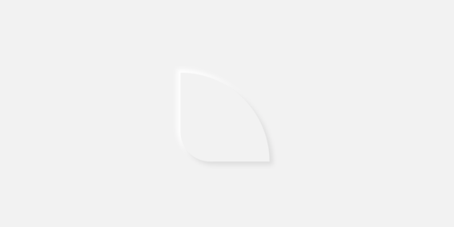
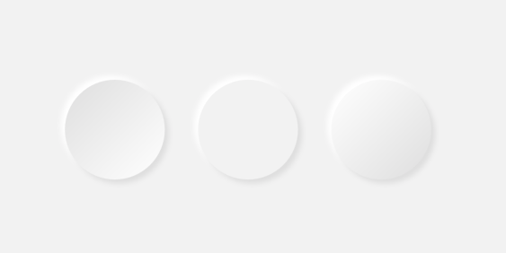
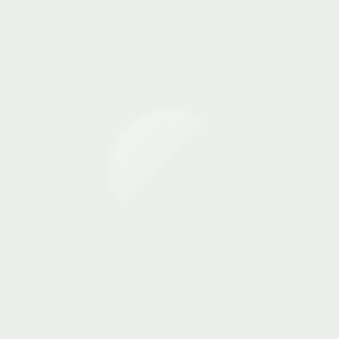

# Clay Containers

Easily create and customize beautiful, modern neumorphic containers for your Flutter project. These clay containers can become the basis for your own unique neumorphic designs. 

## Installation

Add `clay_containers` to your project as a [dependency in your pubspec.yaml file](https://flutter.dev/docs/development/packages-and-plugins/using-packages). This is a simple Dart plugin, so additional configuration for iOS and Android is not needed.

## Examples

### Simple `ClayContainer`
For best results, set the background
color of a surrounding Widget to match
the color you will set for your clay
container. Since it is likely you'll reuse this base color
multiple times (especially if you end up doing something fancy)
it's good to set this color to a single value. In the following example it
is set to `baseColor`.

```
import 'package:clay_containers/clay_containers.dart';

class MyExampleScreen extends StatelessWidget {
  @override
  Widget build(BuildContext context) {
    Color baseColor = Color(0xFFF2F2F2);

    return Container(
        color: baseColor,
        child: Center(
          child: ClayContainer(
            color: baseColor,
            height: 200,
            width: 200,
          ),
        ),
      );
  }
}
```



### `ClayContainer` with Child

In the previous example the `ClayContainer` was given `height` and `width`
since it has no child.
`ClayContainer` behaves the same as a normal
`Container` and needs to be either given `height` and `width` or a `child` to be visible. In the following example, the `ClayContainer` will receive a child. However, I'm going to wrap that child in some `Padding` in order to make sure it isn't flesh with the edge of the parent container. 

```
ClayContainer(
    color: baseColor,
    child: Padding(
      padding: EdgeInsets.all(20),
      child: Text(
        "Seize the Clay!",
        style: TextStyle(
          fontSize: 40,
          fontWeight: FontWeight.w200,
          color: Colors.black45,
        ),
      ),
    ),
  ),
```



### Rounded `ClayContainer`s

Don't be a square! Use borderRadius to add some flare. If you want a uniform `borderRadius` you can simply set it directly in the `ClayContainer` constructor.

```
ClayContainer(
          color: baseColor,
          height: 150,
          width: 150,
          borderRadius: 75,
        ),
```


If you want to pass your own custom `BorderRadius` object, that is available as well: In that case pass it to `customBorderRadius`. 

```
ClayContainer(
          color: baseColor,
          height: 150,
          width: 150,
          customBorderRadius: BorderRadius.only(
              topRight: Radius.elliptical(150, 150),
              bottomLeft: Radius.circular(50)),
        ),
```


### Change Default Spread and Depth

Don't like the default look of the neumorphic effect? Change the base variables. Do whatever you want. I'm not your mom. 

```
ClayContainer(
          color: baseColor,
          height: 150,
          width: 150,
          borderRadius: 75,
          depth: 40,
          spread: 40,
        ),
```


### Concave and Convex `ClayContainer`s

Give your `ClayContainer` a convex or a concave look by passing either `CurveType.concave` or `CurveType.convex` to the `curveType` parameter. 

```
Row(
          mainAxisAlignment: MainAxisAlignment.center,
          children: <Widget>[
            ClayContainer(
              color: baseColor,
              height: 150,
              width: 150,
              borderRadius: 75,
              curveType: CurveType.concave,
            ),
            SizedBox(width: 50),
            ClayContainer(
              color: baseColor,
              height: 150,
              width: 150,
              borderRadius: 75,
              curveType: CurveType.none,
            ),
            SizedBox(width: 50),
            ClayContainer(
              color: baseColor,
              height: 150,
              width: 150,
              borderRadius: 75,
              curveType: CurveType.convex,
            ),
          ],
        ),
```


### Animate It!

Animation is not something included in this plugin, but having these values abstracted makes it easier to do things like animate your neumorphic elements. You can find the source for the example image below in this project's `./example` folder. 

